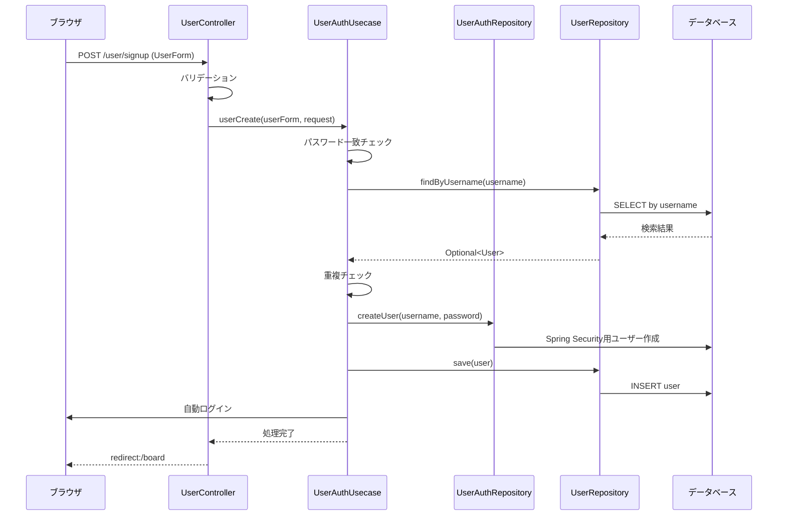
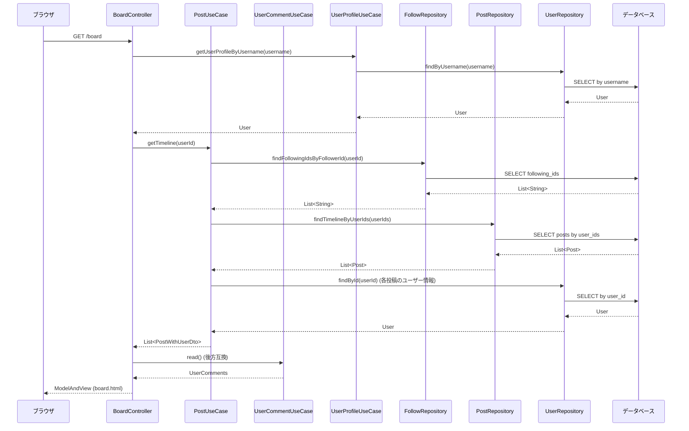
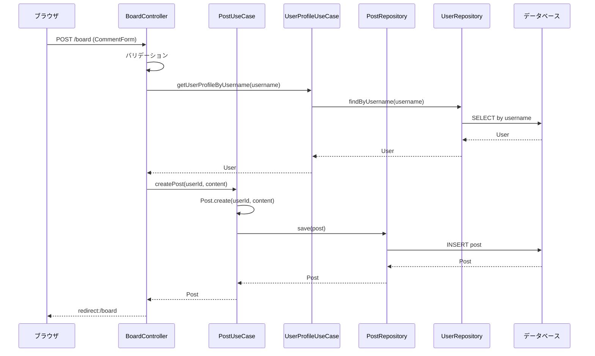
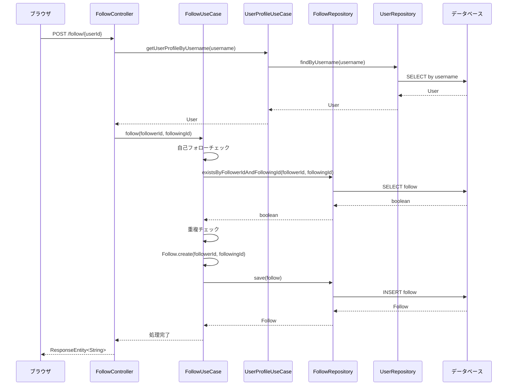
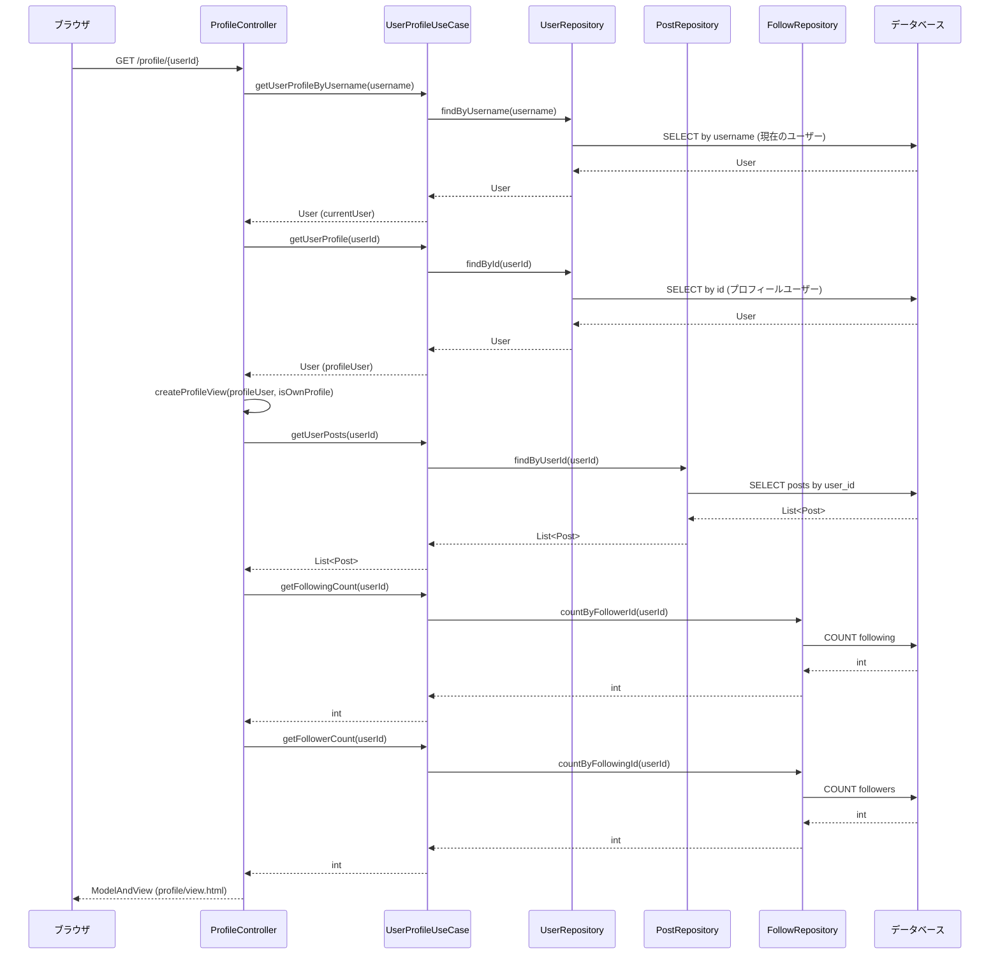
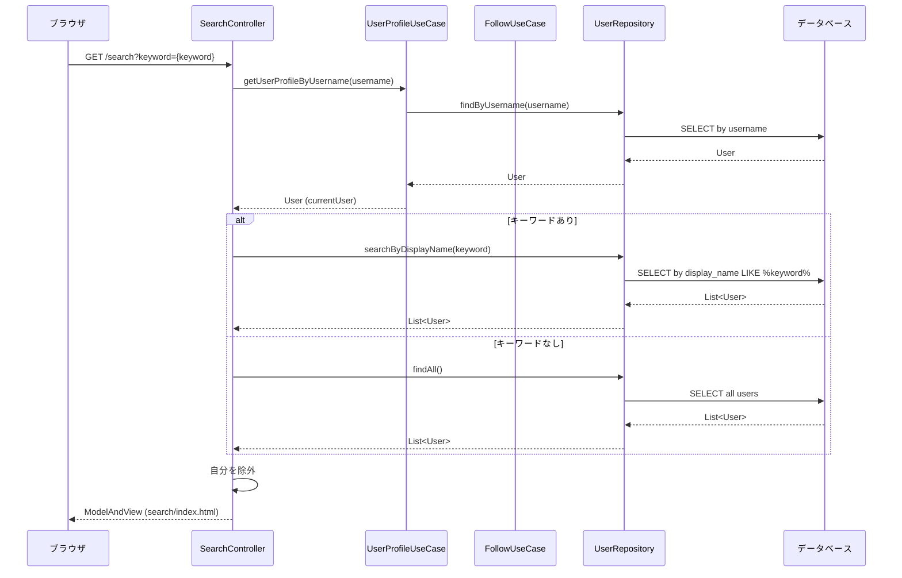
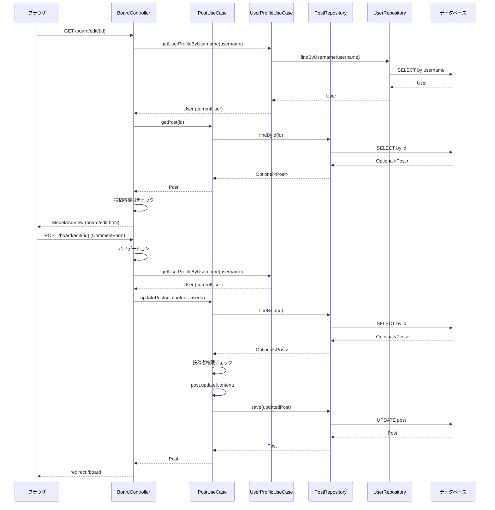

# シーケンス図

## 1. ユーザー登録機能

## 2. 投稿表示機能（タイムライン）

## 3. 投稿作成機能

## 4. フォロー機能

## 5. プロフィール表示機能

## 6. ユーザー検索機能

## 7. 投稿編集・削除機能

## アーキテクチャ概要

このアプリケーションは以下の3層アーキテクチャを採用しています：

1. **プレゼンテーション層 (Controller)**
   - ユーザーからのリクエストを受け取り、レスポンスを返す
   - バリデーション、セッション管理、認証チェックを担当

2. **ビジネスロジック層 (UseCase)**
   - アプリケーションの核となるビジネスルールを実装
   - トランザクション管理、ドメインオブジェクトの操作を担当

3. **データアクセス層 (Repository)**
   - データベースとの通信を抽象化
   - CRUD操作とクエリの実装を担当

各層が疎結合になっており、依存関係は上位層から下位層への一方向となっています。